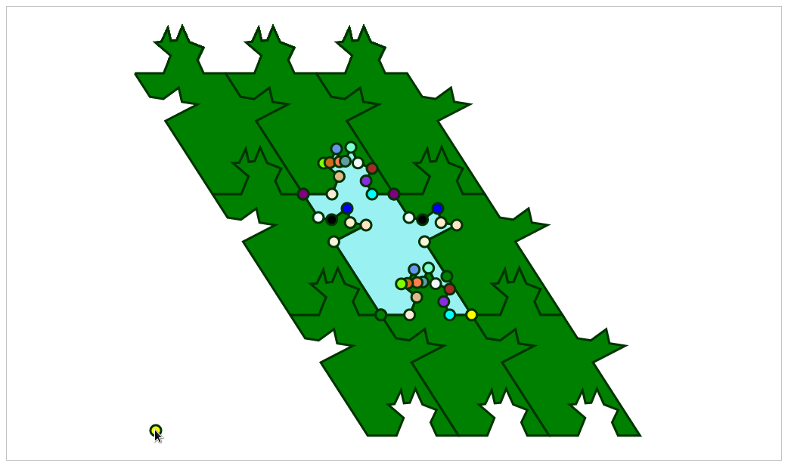

# Parket

## [Play with it]

The project was inspired by works of a 20th century artist M.C. Escher who produced woodcuts and lithographs with complex symmetries by hand. My idea was to facilitate this process by creating a tool which will do most of the calculations leaving people more time to do the creative work.

This tool allows to create pictures with one of the 17 existing types of two-dimensional symmetries.

Below you can see an example of creating a symmetrical picture with Parket. Colored points correspond to points which preserve symmetry. This symmetry is expressed in two translations: one translation up and one translation to the right. It means that you can glide one tile of a picture by a fixed vector (e.g. “to the right”) and it will come onto itself.

Extra: [Blog post with the project story]

## Thanks
Thanks to Aaron and Kevin, [Mathcamp] 2014 mentors, for the project mentorship.

## License
See the [LICENSE](LICENSE.md) file for license rights and limitations (MIT).

   [Play with it]: <https://murfel.github.io/parket/>
   [Blog post with the project story]: <http://murf3l.blogspot.ru/2015/09/tessellation.html>
   [Mathcamp]: <http://mathcamp.org>
